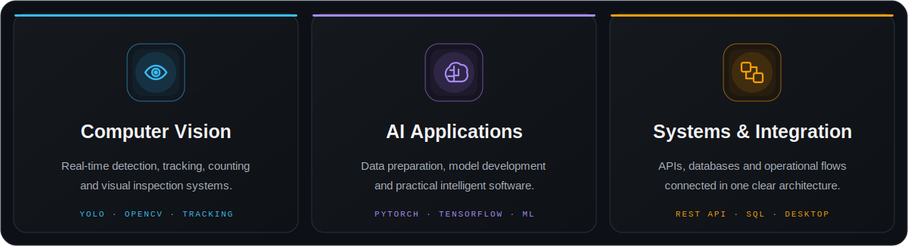

 

 

&nbsp;
&nbsp;
&nbsp;

## About

I am a **Computer Engineer** focused on computer vision and applied artificial intelligence. I have hands-on experience designing end-to-end solutions for industrial environments, including real-time object detection, multi-object tracking, counting, visual quality inspection and data preparation.

I enjoy owning the full engineering path: shaping datasets, developing and evaluating models, building Python applications, connecting APIs and databases, and validating systems in real-world conditions. My goal is to create reliable software that turns visual data into clear, measurable operational value.

## What I Build

## Technologies

#### AI & Computer Vision

#### Languages & Application Development

#### Backend & Data

#### Tools & Platforms

## Selected Work

