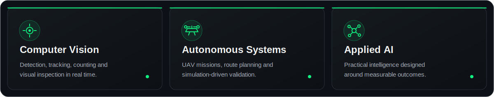
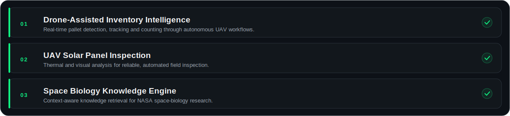

 

 

&nbsp;
&nbsp;
&nbsp;

## About

> I am a **Computer Engineer** focused on computer vision, artificial intelligence and autonomous systems. I build reliable software that connects visual intelligence with real-world operations.

  <code>Detect</code>&nbsp;&nbsp;→&nbsp;&nbsp;<code>Track</code>&nbsp;&nbsp;→&nbsp;&nbsp;<code>Understand</code>&nbsp;&nbsp;→&nbsp;&nbsp;<code>Act</code>

## What I Build

## Technologies

## Selected Work

Explore more on [**my portfolio**](https://suleymansametkaya.com.tr) or browse [**all repositories**](https://github.com/suleymansametkaya?tab=repositories).

 

Open to conversations around computer vision, autonomous systems and applied AI.

